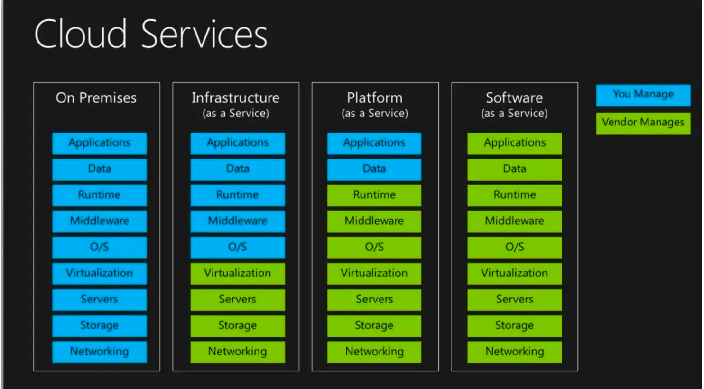
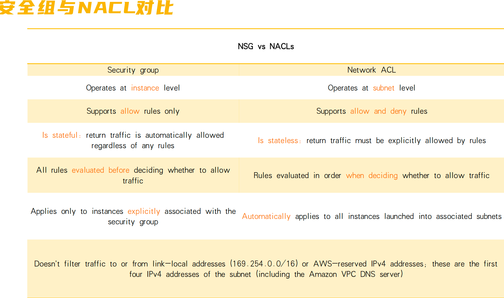
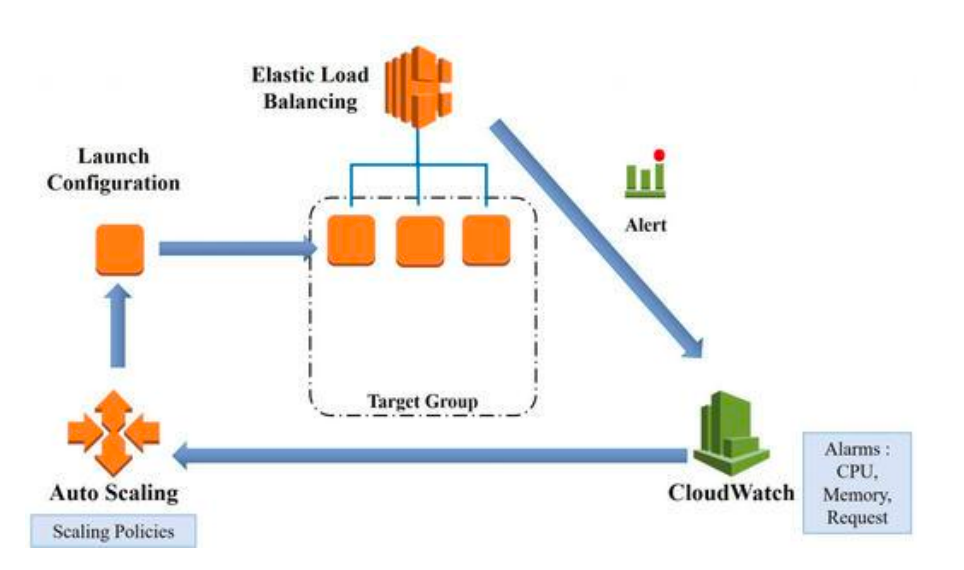
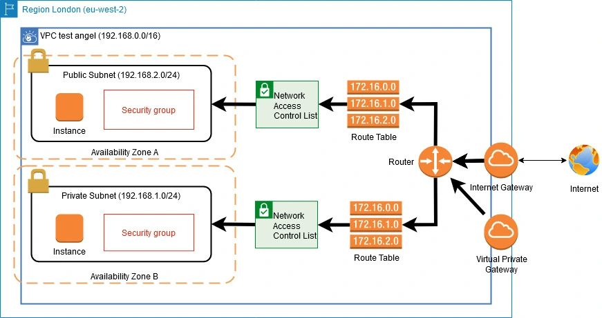

# ☁️ AWS 入门教程
## 云服务模型
::: info 类型划分
- IaaS（基础设施即服务）
- PaaS（平台即服务）
- PaaS（平台即服务）
:::

## 云计算
### EC2(云上服务器)
::: tip ELB(负载均衡)
- Application Load Balancer
- Network Load Balancer
- Gateway Load Balancer
:::
::: info Auto Scaling(弹性伸缩)
:::
### EBS （块存储用于存储相当于硬盘）
- SSD ( 固态硬盘,访问速度快，但是价格偏贵)
- HDD（普通， 访问速度较慢，但是价格便宜）
### NSG （安全组）/ NACL (充当防火墙)

### Cloud Watch (云监控)

### lambda 
- 函数 执行的代码
- trigger  可以使http 调用或S3 上传触发等
- 执行环境   安全隔离
- runtimes  nodejs, java 等
## 网络
### VPC

::: tip VPC(虚拟私有云，独立的虚拟网络)
- Subnet
- Route Tables
- internet gateways
- NAT (Network Address Translation)
- peering 对等连接
- endPoint(用于和S3 内网相连)
:::
### 连接方式
- Direct connect(建立专线相对安全费用高)
- VPN
	- point to site
	- site to site
### CloudFont CDN 
 CDN 会被部署到多个site 当网路请求的时候会就近请求最近的站点

## 存储
- S3 (simple storage service)
	- Bucket
	- Object
- EBS 块存储 访问最快 同时只能支持一个EC2 访问
- EFS 文件存储 分层级 可以同时被多个EC2访问
- Data Async  数据传输工具 提供 本地和aws, aws 和aws 之间的数据传输
- AWS Storage Gateway 混合云存储服务 它将您的本地 IT 环境与 AWS 云存储（如 Amazon S3 和 Amazon Glacier）无缝连接，允许本地应用程序使用几乎无限的云存储，同时通过本地缓存提供低延迟访问。
## 数据库
- **RDS  关系型数据库，支持弹性收缩**
- **DynamoDB 非关系型数据库**
- **Redshift  数据仓库:** 数据库和数据仓库的主要区别在于用途、数据类型、设计目的和用户群体不同。数据库主要面向事务处理，用于支持实时的业务操作，如银行交易，并追求数据的一致性和实时性。而数据仓库面向分析，用于存储大量的历史数据，支持决策分析、报表生成和数据挖掘
- **DMA  用于数据库迁移**

## 权限管理IAM
1.	user
2. group
3.	role
